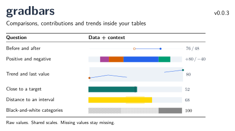

# gradbars

**Compact data graphics inside ordinary LaTeX tables.**

**v0.0.4 · pdfLaTeX / XeLaTeX / LuaLaTeX · MIT**

**Available on CTAN:** [gradbars package page](https://ctan.org/pkg/gradbars), with the archived release, documentation and download links.

[简体中文](README.md) · [English manual PDF](gradbars-manual-en-v0.0.4.pdf) · [中文手册 PDF](gradbars-manual-v0.0.4.pdf)



Use a consistent scale, keep real numbers visible, and add a small graphic directly
to a table cell. No `tikzpicture` wrapper or shell escape is required.

## New in v0.0.4: dedicated visual tables

- **Declare columns and supply rows:** `gradcolumn` and `gradrow` build tables without manual cell separators or row endings.
- **Nine column types:** text, number, bar, bullet, interval, layered comparison, dumbbell, stack and sparkline.
- **Alignment and rules:** horizontal alignment, independent header alignment, vertical text alignment, four rule styles and adjustable spacing.
- **Width allocation:** reserve labels and fixed columns, then distribute available width among flexible text and graphic columns.
- **Structured results:** multilevel spanning headers, row groups, bold best values and underlined second-best values, including ties and lower-is-better metrics.
- **Reuse and pagination:** named table styles and schemas; `long=true` repeats complete headers and keeps widths and ranking consistent across pages.
- **Graphic annotations:** multiple references, bullet charts, grouped intervals, overflow indicators, marker shapes, change arrows and relative-change labels.

The Chinese manual has six parts, 42 chapters and 77 numbered examples. The English manual has six parts and 28 sections. Both include rendered output and source.

## Quick start

Copy `gradbars.sty` next to your main `.tex` file. The package works with **pdfLaTeX, XeLaTeX and LuaLaTeX**.
Dependencies include TikZ/PGF, xparse, expl3, collcell, array, booktabs, colortbl and longtable, available in standard TeX installations.
Chinese fonts are needed only for the Chinese manual, not for the package.

```latex
\documentclass{article}
\usepackage{gradbars}
\setlength{\parindent}{0pt}
\begin{document}
\begin{gradtable}[width=\linewidth,header align=c,
  label width=12mm,column sep=6pt]
  \gradcolumn{method}{Method}
  \gradcolumn[type=bar,weight=2,mark=both,
    options={max=100,precision=1}]{score}{Score}
  \gradcolumn[type=number,width=22mm,mark=best,
    options={better=lower,precision=1}]{time}{Time / ms}
  \gradheader{\gradspan{1}{Setup}\gradspan{2}{Evaluation}}
  \gradgroup{Baselines}
  \gradrow{Method A,82.4,14.8}
  \gradrow{Method B,91.6,18.2}
  \gradgroup{Improved}
  \gradrow{Method C,87.3,11.5}
  \gradrow{Pending,NA,NA}
\end{gradtable}
\end{document}
```

Higher scores and lower times are better. Best values are bold; the second-best score is underlined. `NA` is missing, not zero.

Tables are indivisible by default. For pagination, add `long=true` and place the table directly in single-column body text, outside floats and minipages.

## Choose a graphic

| Need | Command or option |
| --- | --- |
| One magnitude or signed change | `\gradbar[min=-50,max=100]{value}` |
| Compact stem and endpoint | `\gradbar[shape=lollipop]{value}` |
| Wide reference behind a narrow current bar | `\gradcompare{reference}{current}` |
| Two positions and their difference | `\graddumbbell[compare label=delta]{before}{after}` |
| Known lower and upper endpoints | `\gradrange[range point=50]{35}{75}` |
| Actual value against background grades | `\gradbullet[bullet bands={{60/black!8},{100/black!20}},target=85]{78}` |
| Additive contributions | `\gradstack[min=-60]{60,-25,20,-15}` |
| Equally spaced time-series shape | `\gradspark{25,40,NA,60,80}` |
| A point estimate with uncertainty distances | `\gradbar[error minus=5,error plus=8]{60}` |

## Preserve data meaning

- Bars share explicit `min`, `max` and `width`. Zero stays at zero; negative values require a negative minimum.
- `unit` appends text. `value format=percent` computes value/max only for nonnegative ranges. Formatting never changes geometry.
- Empty input or `NA` denotes missing data. A missing spark observation breaks the line and retains its horizontal position.
- Signed stacks accumulate from zero independently on each side. The default total is the algebraic sum; `stack totals=separate` shows positive / negative subtotals.
- Stack segment percentages use `abs(segment) / sum(abs(segments))`. They are shares of absolute activity, not of the net balance. Stacks do not automatically normalize to full width.
- Auto-scaled sparklines compare shapes. Use `spark range=fixed` with the same `min`, `max`, `width` and `height` to compare levels across rows.
- Overflow warns and clips the drawing while retaining raw labels; use `overflow=error` for strict checking.

## Express quality separately

```latex
% Within 5 of the goal is good; within 15 is intermediate.
\gradbar[better=target,quality target=50,
  thresholds={5,15},target=50,palette=diverging]{52}

% Inside [40,60] is good; no more than 10 away is intermediate.
\gradbar[better=interval,quality range={40,60},
  thresholds={0,10},band={40,60},palette=diverging]{68}
```

`threshold colors` always lists bad, intermediate, good. In target/interval modes,
thresholds are nonnegative distances with inclusive upper boundaries.
`quality target` / `quality range` evaluate data; `target` / `band` draw references.
`better=higher|lower` remains available for monotonic metrics.

## Reuse appearance and category identity

```latex
\gradbarsstyle{paperrow}{preset=paper,width=40mm,max=100,precision=1}
\gradbar[style=paperrow]{82.5}

\gradbarscategory{Compute}{gradbarsBlue}{diagonal}
\gradbarscategory{Storage}{gradbarsOrange}{dots}
\gradstack[stack names={Compute,Storage}]{60,30}
\gradstack[stack names={Storage,Compute}]{30,60}
\gradbarslegend{Compute,Storage}
```

Four layout presets: `paper`, `report`, `presentation`, `outline`.
Four group palettes: `categorical`, `sequential`, `diverging`, `mono`.
Seven themes and nine original solid colors remain available.
Unregistered categories use cyclic position-based palettes; registered names preserve
their assigned color and pattern. In print/mono mode category colors use the grayscale
palette, while registered patterns remain. Legends use the same mapping as segments.

## CSV and existing tables

```latex
\gradbarsloadcsv{results}{results.csv}
\gradbarscsvstyle{shared}{results}{Score}
\gradbarcsv[style=shared]{results}{1}{Score}
\gradbarscolumn{G}{style=shared}
```

CSV fields are read as character data, not executed as TeX. Named columns, quoted commas,
custom missing tokens and shared column ranges are supported. See the manual for complete tables.

## Documentation and building

The [single Chinese manual](docs/gradbars-manual.tex) is organized into quick start,
graphics, appearance, visual tables and data interfaces, complete layouts, and reference.
It contains 77 numbered examples, including visual tables, before/after evaluation,
a monochrome contribution ledger and a monthly trend summary. The English manual
covers v0.0.4 in six parts and 28 sections with independent numbering. All example data are illustrative.

To generate the versioned PDF in the repository root:

```sh
python scripts/build_manual.py
```

The script rebuilds the four layouts and the Chinese manual with XeLaTeX, then the English manual with pdfLaTeX; each document gets two passes.
It requires ctex/Fandol and the LaTeX extra packages; Python is only a documentation-build helper.
Both versioned PDF manuals are included. The [English source](docs/gradbars-manual-en.tex) builds with pdfLaTeX; the Chinese manual uses XeLaTeX. All text files use LF line endings.

## Scope and limits

- pdfLaTeX, XeLaTeX and LuaLaTeX have passed package checks including CSV input. Only the Chinese documentation requires the XeLaTeX/ctex workflow. This is a table-oriented interface, not a full plotting system.
- CSV accepts single-line comma-separated fields; automatic CSV tables do not paginate.
- Stacks reject missing segments, conditional thresholds and error whiskers.
- Sparklines use equally spaced observations; they do not parse dates or draw bar targets, error whiskers or reference bands.
- Fixed scales require `min <= 0` and `max > 0`; auto spark ranges can be positive, negative or constant.
- Label avoidance is local to a graphic. Allow room for long external labels and legends.
- Accessible tagged chart descriptions and tabularray-specific column handling are not implemented.

MIT licensed. Bug reports should include a minimal `.tex` example, engine and log.
