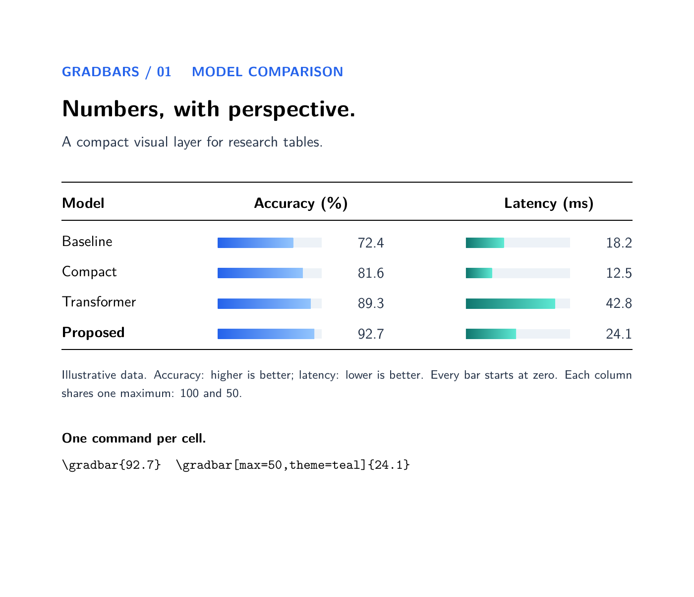
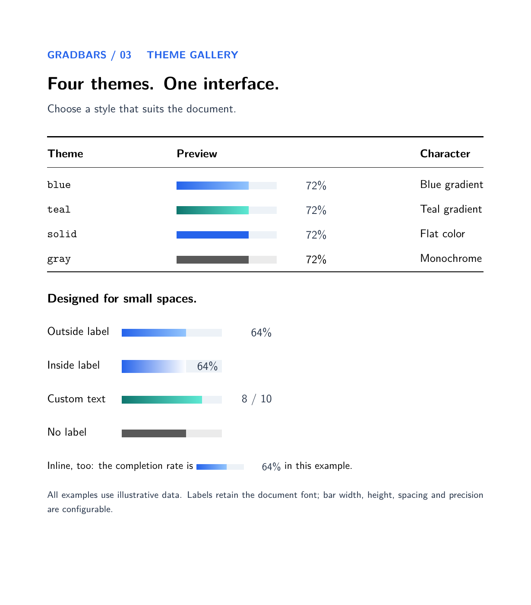

# gradbars

**Compact data bars for LaTeX tables and inline text.**

Add a data bar directly to a table cell or a line of text, with consistent scales,
labels, and reference markers. Built on TikZ, gradbars provides a focused interface
for model comparisons, dataset summaries, and progress reports.

**v0.0.2 · XeLaTeX · MIT**

[中文说明](README.zh-CN.md) · [Illustrated manual (Chinese PDF)](gradbars-manual-v0.0.2.pdf) · [API reference](docs/api.md)



## Why gradbars?

- **Use ordinary table cells.** Write `\gradbar{72}`, or define a numeric column
  with `\gradbarscolumn{G}{...}` and enter only numbers in its cells.
- **Keep data and display separate.** Raw values determine geometry; labels can
  show values, computed percentages, custom text, or scientific notation.
- **Make comparisons consistent.** Reuse named styles, explicit column ranges,
  bar widths, and fixed outside label slots.
- **Add context in the same cell.** Combine targets, reference bands, conditional
  colors, signed bars, and error whiskers; use `\gradstack` for nonnegative compositions.
- **Label compositions automatically.** Add segment names, percentages and shared legends;
  small labels move outside, while automatic text colors adapt to dark or light fills.
- **Start from documented examples.** The single manual contains 37 examples with
  both rendered output and source, including the built-in palette of 16 choices:
  seven themes and nine solid colors.

gradbars packages established visualization techniques into a reusable table-oriented
interface. It does not claim to introduce new chart types or replace a general plotting system.

## Quick start

Copy `gradbars.sty` next to your main `.tex` file. Compile with XeLaTeX using a recent TeX installation
with TikZ. No shell escape, Python, or Chinese typesetting package is needed.
For Overleaf, upload the `.sty`, paste the example below into a `.tex` document,
and select XeLaTeX as the compiler.
The package is not yet distributed through CTAN.

```latex
\documentclass{article}
\usepackage{booktabs}
\usepackage{gradbars}
\begin{document}
\gradbarssetup{width=24mm,max=100,precision=1,theme=blue}
\begin{tabular}{lc}
\toprule
Model & Accuracy (\%) \\
\midrule
Baseline & \gradbar{72.4} \\
Proposed & \gradbar{92.7} \\
\bottomrule
\end{tabular}
\end{document}
```

No `tikzpicture` wrapper is needed. `\gradbarssetup{...}` sets defaults in the
current TeX scope; `\gradbar[...]{value}` overrides them for one bar.

## Numbers mean what they say

By default the scale is 0 to `max`. Set a negative `min` for signed bars; the fill extends from zero to the value.
Use the same maximum, width, and label slot for every bar in a comparison column.
Greater length means a larger value, not necessarily better performance.

```latex
\gradbar[max=200]{50}                       % quarter full, label 50.0
\gradbar[max=200,unit={\,ms}]{50}            % quarter full, label 50.0 ms
\gradbar[max=200,value format=percent]{50}   % quarter full, label 25.0%
\gradbar[max=100,unit={\%}]{86.5}            % data already in percent: 86.5%
\gradbar[max=10,text={8 / 10}]{8}            % custom label, unchanged geometry
```

- `unit` only appends a suffix; it does not transform the data.
- `value format=percent` computes `100 * value / max` and adds `%`. It ignores `unit`.
- `text` overrides the entire label; `text={}` restores automatic formatting.
- Zero shows only the empty track. Small positive values are never inflated.
- Empty input or uppercase `NA` means missing data, distinct from zero; other
  nonnumeric input is an error.
- Values above `max` warn and clip the bar, while retaining the real label.
  Use `overflow=error` for strict validation.
- Negative values require a negative `min`. The maximum must be positive.
- Percent format is only allowed with `min=0`; use a literal unit for signed changes.

## 16 built-in palette choices

Use `theme` for seven themes and gradient presets, and `color` for nine solid colors.

| Theme | Appearance | Example |
| --- | --- | --- |
| `blue` | Blue gradient; default | `\gradbar[theme=blue]{72}` |
| `teal` | Teal gradient | `\gradbar[theme=teal]{72}` |
| `solid` | Flat blue | `\gradbar[theme=solid]{72}` |
| `gray` | Monochrome | `\gradbar[theme=gray]{72}` |



Labels can sit `outside` or `inside` the track, above the endpoint with `label=end`,
or be hidden with `label=none`.
Outside labels use a right-aligned slot that expands for long content by default.
Set a common `label width` large enough for every value to keep a column aligned.
`label=auto` chooses an inside or outside placement; `text color=auto` selects black or white.

Additional gradients: `theme=lbyellow`, `theme=viblue`, `theme=cyblu`.
Built-in solid color usage: `\gradbar[color=lightblue]{80}`.
`lightgreen`, `lightyellow`, `lightblue`, `lightred`, `rose`, `skyblue`, `gold`, `lavender`, `peach`.


## Effects in v0.0.2

```latex
\gradbar[rounded=2pt]{72}
\gradbar[target=80]{72}
\gradbar[thresholds={60,80},threshold colors={lightred,gold,lightgreen}]{72}
\gradbar[label=end]{72}
\gradbar[min=-50,max=50]{-25}
\gradbar[error minus=4,error plus=9]{72}
```


## Styles, missing data, formats, bands and stacks

```latex
\gradbarsstyle{score}{max=100,theme=teal,rounded=2pt}
\gradbar[style=score]{72}
\gradbar[missing text={N/A}]{NA}
\gradbar[max=200000,number format=grouped,precision=0]{125000}
\gradbar[max=1,number format=scientific,precision=2]{0.00001234}
\gradbar[band={60,80},target=70]{75}
\gradstack[stack colors={skyblue,rose,gold}]{30,25,15}
```

Styles follow TeX grouping and support per-bar overrides. `missing text` changes
the missing-data label. Number formatting changes labels without changing bar lengths.
Bands use data units and must lie within the scale.

Stacks use nonnegative raw segment values; the default maximum is 100. For example,
`{30,25,15}` fills 70% of the default track and labels the total as `70.0`.
Stacks do not automatically normalize to 100%, and reject missing or negative segments.
See the [API reference](docs/api.md) for validation rules and option combinations.

## New in v0.0.2

```latex
% Declare in the preamble, then use G in tabular or longtable.
\gradbarscolumn{G}{max=100,width=30mm,precision=0}
% A row can now be: Model A & 82 \\

\gradstack[width=70mm,height=16pt,precision=0,
  stack names={Train,Validation,Test},
  segment labels=name percent,legend=true]{80,2,18}

\gradbar[theme=solid,width=40mm,height=15pt,
  label=auto,text color=auto]{86}
```

Use `\multicolumn{1}{c}{Score}` for text headers in numeric columns.
Stack segment percentages use the sum of the raw segments; the total's percentage
uses the scale maximum. Automatic collision handling is local to each bar.
The manual explains label overflow, row heights, common column scales, and missing versus zero values.

## How it relates to other packages

These tools overlap in capability. The distinction is the intended workflow,
not whether another package can produce a similar picture.

| Package | Main focus | Where gradbars fits |
| --- | --- | --- |
| [progressbar](https://ctan.org/pkg/progressbar) | Configurable bars representing a share between 0 and 1 | Accept raw data with explicit ranges, formatted labels, and reference markers |
| [bchart](https://ctan.org/pkg/bchart) | Simple horizontal bar charts in a chart environment | Place individual bars directly in existing table cells or prose |
| [sparklines](https://ctan.org/pkg/sparklines) | Compact, wordlike graphics | Focus on value bars, composition, and reference markers within a cell |
| [databar / datatool](https://dickimaw-books.com/latex/admin/html/databar.shtml) | Generate bar charts from database data | Draw supplied values in an existing table; no database or CSV ingestion layer |
| [pgfplots](https://ctan.org/pkg/pgfplots) | General plotting with axes, bar and stacked plots, and error bars | Offer a focused interface for compact cell-level bars; use pgfplots for full plots |

For simple progress indicators, `progressbar` may already be enough. For full axes
or varied plot types, consider `pgfplots`. Choose gradbars when the table is the
main document structure and each cell needs a compact, consistently configured data bar.

## One manual, output and source together

The [illustrated manual](gradbars-manual-v0.0.2.pdf) brings 37 numbered examples,
a selection guide and an FAQ into one document. It includes three application tables
and four real layouts: a two-column article, a multi-page longtable, grayscale output,
and a Beamer slide. Short examples put output beside highlighted source; larger
examples use output above source. The real layouts include compiled previews and
their complete source. The editable source is
[gradbars-manual.tex](docs/gradbars-manual.tex).

To rebuild all layouts and the Chinese manual, install XeLaTeX with the LaTeX extra
and Chinese language collections (including ctex and Fandol), then run:

~~~sh
python scripts/build_manual.py
~~~

Python is only a convenience for rebuilding the documentation; the package itself
does not require it. The script builds each real layout twice before the manual.
For manual text edits with unchanged layout sources, the included layout PDFs let
you compile directly from the repository root:

~~~sh
xelatex -interaction=nonstopmode -halt-on-error "-jobname=gradbars-manual-v0.0.2" docs/gradbars-manual.tex
xelatex -interaction=nonstopmode -halt-on-error "-jobname=gradbars-manual-v0.0.2" docs/gradbars-manual.tex
~~~

All data in the examples are illustrative.

All examples and source are included in the manual. The compiled PDF is saved in the repository root. GitHub Actions builds the manual on pushes and pull requests.

## Current scope

- The supported workflow is XeLaTeX; the package uses TikZ, `xparse`, `expl3`, and `collcell` (including array).
- Column ranges are explicit. CSV ingestion and automatic column maxima are not implemented.
- Stacks require `min=0` and nonnegative segments. They do not support error whiskers
  or conditional thresholds; signed values remain available with `\gradbar`.
- Label avoidance is local to one bar. Long outside labels may still need a wider
  table column; automatic black/white text estimates the background at the label center.
- Numeric columns are demonstrated with tabular and longtable; tabularray-specific
  column handling has not been validated.
- Accessible tagged chart descriptions are not generated.

## License

MIT. See [LICENSE](LICENSE). Contributions and small reproducible bug reports
are welcome. Include your engine, TeX distribution, and log when reporting issues.
