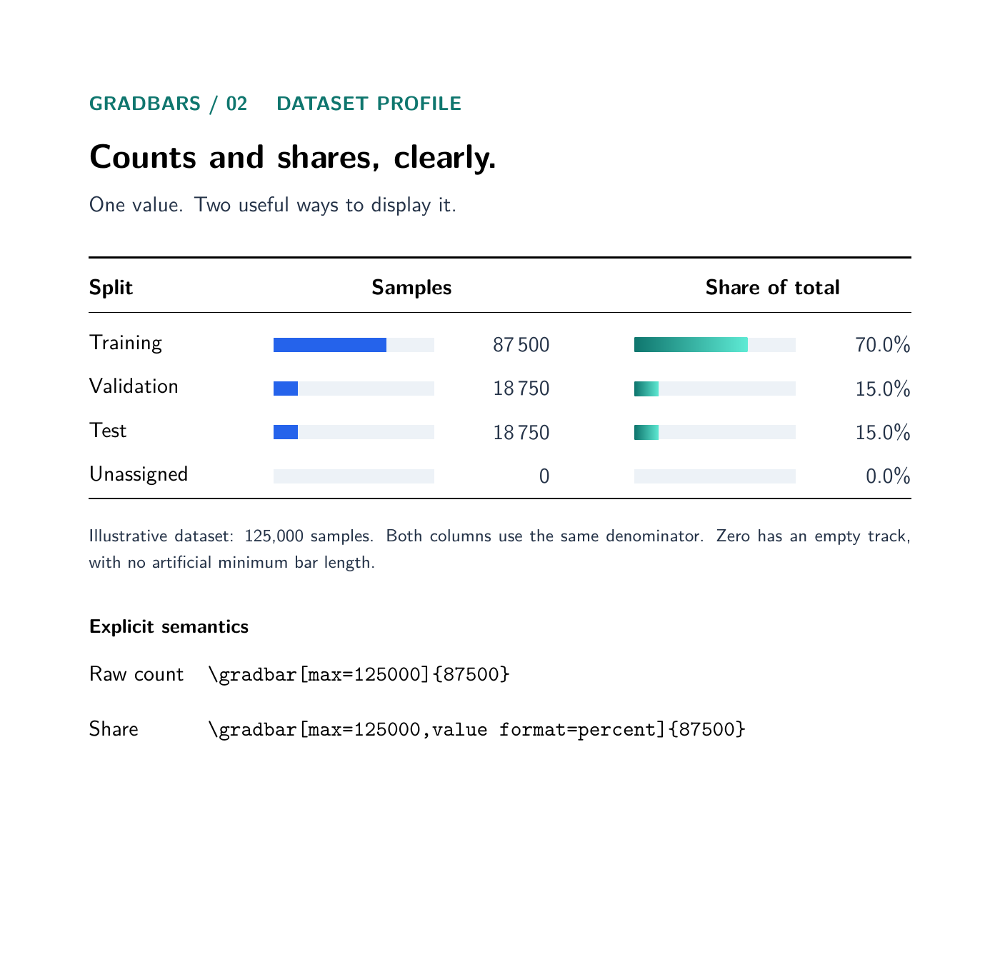

# gradbars

**Small data bars. Clearer LaTeX tables.**

Add a bar directly to a table cell or a line of text with one command.
Seven themes and nine built-in colors, shared column scales, explicit units, and no external graphics.

[中文说明](README.zh-CN.md) · [Illustrated manual (Chinese PDF)](docs/gradbars-manual-v3.1.pdf) · [API reference](docs/api.md) · [Migration from v2](docs/migration.md)


## Quick start

Copy `gradbars.sty` next to your main `.tex` file. Compile with XeLaTeX using a recent TeX installation
with TikZ. No shell escape, Python, or Chinese typesetting package is needed.
For Overleaf, upload the `.sty` and choose an example as the main document.
The package is not yet distributed through CTAN.

```latex
\documentclass{article}
\usepackage{booktabs}
\usepackage{gradbars}
\begin{document}
\gradbarssetup{width=24mm,max=100,precision=1,theme=blue}
\begin{tabular}{lc}
\toprule
Model & Accuracy (\%) \\
\midrule
Baseline & \gradbar{72.4} \\
Proposed & \gradbar{92.7} \\
\bottomrule
\end{tabular}
\end{document}
```

No `tikzpicture` wrapper is needed. `\gradbarssetup{...}` sets defaults in the
current TeX scope; `\gradbar[...]{value}` overrides them for one bar.

## Numbers mean what they say

By default the scale is 0 to `max`. Set a negative `min` for signed bars; the fill extends from zero to the value.
Use the same maximum, width, and label slot for every bar in a comparison column.
Greater length means a larger value, not necessarily better performance.

```latex
\gradbar[max=200]{50}                       % quarter full, label 50.0
\gradbar[max=200,unit={\,ms}]{50}            % quarter full, label 50.0 ms
\gradbar[max=200,value format=percent]{50}   % quarter full, label 25.0%
\gradbar[max=100,unit={\%}]{86.5}            % data already in percent: 86.5%
\gradbar[max=10,text={8 / 10}]{8}            % custom label, unchanged geometry
```

- `unit` only appends a suffix; it does not transform the data.
- `value format=percent` computes `100 * value / max` and adds `%`. It ignores `unit`.
- `text` overrides the entire label; `text={}` restores automatic formatting.
- Zero shows only the empty track. Small positive values are never inflated.
- Values above `max` warn and clip the bar, while retaining the real label.
  Use `overflow=error` for strict validation.
- Negative values require a negative `min`. The maximum must be positive.
- Percent format is only allowed with `min=0`; use a literal unit for signed changes.

## Seven themes and nine built-in colors

| Theme | Appearance | Example |
| --- | --- | --- |
| `blue` | Blue gradient; default | `\gradbar[theme=blue]{72}` |
| `teal` | Teal gradient | `\gradbar[theme=teal]{72}` |
| `solid` | Flat blue | `\gradbar[theme=solid]{72}` |
| `gray` | Monochrome | `\gradbar[theme=gray]{72}` |


Labels can sit `outside` or `inside` the track, or be hidden with `label=none`.
Outside labels have a fixed, right-aligned slot. Increase `label width` for long
values or units. Colors, font, dimensions, and spacing are configurable.
For inside labels, choose colors with sufficient contrast.

Additional gradients: `theme=lbyellow`, `theme=viblue`, `theme=cyblu`.
Built-in solid color usage: `\gradbar[color=lightblue]{80}`.
`lightgreen`, `lightyellow`, `lightblue`, `lightred`, `rose`, `skyblue`, `gold`, `lavender`, `peach`.


## New effects in v3.1

```latex
\gradbar[rounded=2pt]{72}
\gradbar[target=80]{72}
\gradbar[thresholds={60,80},threshold colors={lightred,gold,lightgreen}]{72}
\gradbar[label=end]{72}
\gradbar[min=-50,max=50]{-25}
\gradbar[error minus=4,error plus=9]{72}
```


## Three complete examples

The [13-page illustrated manual](docs/gradbars-manual-v3.1.pdf) brings all three
applications and 22 numbered examples into one document. Short examples put the
output beside highlighted source; full tables put the output above the source.
Both views are generated from the same code. The editable source is
[gradbars-manual.tex](docs/gradbars-manual.tex).

To rebuild the Chinese manual, install the Chinese language collection, including
ctex and Fandol fonts, and run XeLaTeX twice from the repository root:

~~~sh
xelatex -interaction=nonstopmode -halt-on-error -output-directory=build docs/gradbars-manual.tex
xelatex -interaction=nonstopmode -halt-on-error -output-directory=build docs/gradbars-manual.tex
~~~

All data in the examples are illustrative.

| Source | What it demonstrates | PDF |
| --- | --- | --- |
| [Model comparison](examples/model-comparison.tex) | Accuracy and latency with different column maxima | [Preview](examples/pdf/model-comparison.pdf) |
| [Dataset profile](examples/dataset-profile.tex) | Large counts, computed percentages, and zero | [Preview](examples/pdf/dataset-profile.pdf) |
| [Theme gallery](examples/theme-gallery.tex) | All themes, label positions, and inline use | [Preview](examples/pdf/theme-gallery.pdf) |



Compile from the repository root after creating `build/`:

```sh
xelatex -interaction=nonstopmode -halt-on-error -output-directory=build examples/model-comparison.tex
```

Alternatively, copy `gradbars.sty` and an example into the same folder.
Examples additionally use `geometry`, `lmodern`, `booktabs`, and `array`.
The package loads TikZ, `xparse`, and `expl3`; it does not load `ctex`.

## Development

The test runner uses only Python's standard library and an installed TeX engine.
Install Poppler for PDF text assertions.

```sh
python tests/run.py --engine xelatex --require-pdf-text
```

Tests compile examples, check fixed widths and local configuration, exercise
invalid input, and verify labels extracted from the resulting PDF.
Generated files stay under `build/<engine>/`.
GitHub Actions is configured to run these checks on pushes and pull requests.

The scope is compact data bars, including signed values, targets and error intervals.
CSV ingestion, automatic column maxima, stacking, and accessible tagged chart descriptions are not implemented. Use a dedicated plotting package for full chart axes.

## License

MIT. See [LICENSE](LICENSE). Contributions and small reproducible bug reports
are welcome. Include your engine, TeX distribution, and log when reporting issues.
